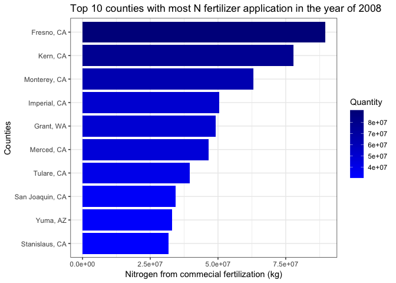

<!-- README.md is generated from README.Rmd. Please edit that file -->

# getFertilizer


[](https://travis-ci.org/wenlong-liu/getFertilizer)
[](https://ci.appveyor.com/project/wenlong-liu/getFertilizer)
[](https://cran.r-project.org/package=getFertilizer)
[](https://cran.r-project.org/package=getFertilizer)

## Retrieve, Summarize and Visualize the Fertilizer Data in USA

Provides a user-friendly API to further dig in County-Level Fertilizer
data in USA, provided by USGS.

## Installation

This package can be installed via github using devtools.

``` r
# install.package("devtools")   #In case you have not installed it.
devtools::install_github("wenlong-liu/getFertilizer")
```

## Quick Start

### Import data and libraries

``` r
require(usfertilizer)
require(getFertilizer)
require(dplyr)
#> Warning: package 'dplyr' was built under R version 3.5.1
require(ggplot2)
data("us_fertilizer_county")
```

### Retrieve fertilizer data

``` r
Year <-  2008
Nutrient <- "N"
Input_Type <- "fertilizer"

# retrieve data.
plot_data <- get_data(data = us_fertilizer_county, years = Year, nutrient = Nutrient, 
                      input_type = Input_Type,  combine_state_county = TRUE)
head(plot_data)
#> # A tibble: 6 x 12
#>   FIPS  State County       ALAND  AWATER INTPTLAT INTPTLONG Quantity Year 
#>   <chr> <chr> <chr>        <dbl>   <dbl>    <dbl>     <dbl>    <dbl> <chr>
#> 1 01001 AL    Autauga,…   1.54e9  2.58e7     32.5     -86.6   783984 2008 
#> 2 01003 AL    Baldwin,…   4.12e9  1.13e9     30.7     -87.7  4948455 2008 
#> 3 01005 AL    Barbour,…   2.29e9  5.09e7     31.9     -85.4  1171588 2008 
#> 4 01007 AL    Bibb, AL    1.61e9  9.29e6     33.0     -87.1   141669 2008 
#> 5 01009 AL    Blount, …   1.67e9  1.52e7     34.0     -86.6  1206109 2008 
#> 6 01011 AL    Bullock,…   1.61e9  6.06e6     32.1     -85.7   629577 2008 
#> # ... with 3 more variables: Nutrient <chr>, Farm.Type <chr>,
#> #   Input.Type <chr>
```

### Summarize and plot data.

#### Example 1: Find out the top 10 counties with most nitrogen appliation in 2008.

``` r
# plot the top 10 nitrogen application in year 2008.
plot <- plot_data %>% 
  top_n(10, Quantity) %>%
  ggplot(aes(x=reorder(County, Quantity), Quantity, fill = Quantity))+
  scale_fill_gradient(low = "blue", high = "darkblue")+
  geom_col()+
  ggtitle(paste("Top 10 counties with most N fertilizer application in the year of", Year)) + 
  scale_y_continuous(name = "Nitrogen from commecial fertilization (kg)")+
  scale_x_discrete(name = "Counties")+
  coord_flip()+
  theme_bw()
plot
```

<!-- -->

### Examples 2: Visualize the fertilizer data in US maps.

``` r
Year = 2001
Nutrient = "N"
Farm_Type = "farm"
Input_Type = "fertilizer"
level  = "county"

# draw the map
us_plot <- map_us_fertilizer(data = us_fertilizer_county, Year = Year, Nutrient = Nutrient,
                             Farm_Type = Farm_Type, Input_Type = Input_Type,
                             viridis_palette = "inferno", level = level)
us_plot <- us_plot +
  ggtitle(paste(Nutrient, " from ", Input_Type, " input to ", Farm_Type, " in the year of ",Year,
                     " at ", level, " level",sep = ""))+
  labs(caption = "Data source: United State Geography Service (USGS)")
us_plot
```

<!-- -->

As the map is a ggplot2 object, users can play with it as normal ggplot2
graphs. Such we can change the projection system of the map to “albers”
projection.

``` r
us_plot +
  coord_map("albers",lat0=39, lat1=45)
```

<!-- -->

The map can also be drawn at state level. The built-in function will
automatically sum up all the data with the corresponding states.

``` r
Year = 2007
Nutrient = "P"
Farm_Type = "nonfarm"
Input_Type = "fertilizer"
level  = "state"

# draw the map
us_plot <- map_us_fertilizer(data = us_fertilizer_county, Year = Year, Nutrient = Nutrient,
                             Farm_Type = Farm_Type, Input_Type = Input_Type,
                             viridis_palette = "inferno", level = level)
us_plot <- us_plot +
  ggtitle(paste(Nutrient, " from ", Input_Type, " input to ", Farm_Type, " in the year of ",Year,
                     " at ", level, " level",sep = ""))+
  labs(caption = "Data source: United State Geography Service (USGS)")
us_plot
```

<!-- -->

For more details about mapping fertilizer data, please see this
[vignettes](https://wenlong-liu.github.io/getFertilizer/articles/US_maps.html)

### Generate summaries plots.

(under development on July 10, 2018)

## Comments and Questions

If you have any problems or questions, feel free to open an issue
[here](https://github.com/wenlong-liu/getFertilizer/issues).

## Lisence

[GPL](https://github.com/wenlong-liu/getFertilizer/blob/master/LICENSE)

## Code of conduct

Please note that this project is released with a [Contributor Code of
Conduct](https://github.com/wenlong-liu/getFertilizer/blob/master/CONDUCT.md).
By participating in this project you agree to abide by its terms.
